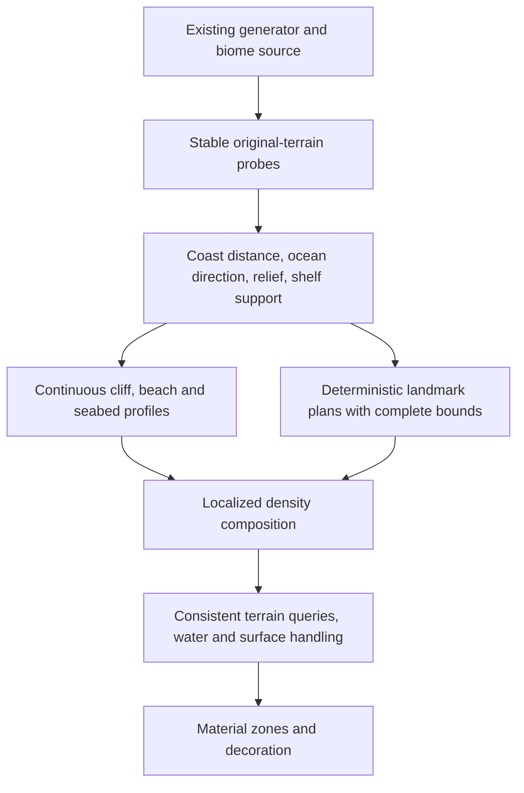

# What to test next in Stony Shore Revival

[Research index](README.md) · Research date: 2026-10-09

## Decision status

These are **research-backed proposals**, not changes already made or commitments to replace the generator. V9 is the current in-game test baseline. The user's V9 observations should determine which experiments move into development first. This research task changes documentation only.

Baseline: [V9 commit `c61270e946adcf06f57ff60c82d90cb3303271b2`](https://github.com/JasperPepper25/Stony-Shore-Revival/tree/c61270e946adcf06f57ff60c82d90cb3303271b2). [V9 test guide](https://github.com/JasperPepper25/Stony-Shore-Revival/blob/c61270e946adcf06f57ff60c82d90cb3303271b2/docs/terrain-test-9.md). This reference is pinned because the development branch will continue moving.

## The visual target

The user's custom examples establish the intended relationships:

- Sand-dominant beaches, occasional stony patches, irregular contours, and a shallow apron that gradually meets the ocean floor.
- Main cliffs retain enough relief and space to remain the defining coastal feature.
- Large arches form part of projecting rock attached to a cliff and extend toward the ocean. The opening should pass through that body, without requiring a deep shaft behind it.
- Overhangs are pronounced shelves beyond the vertical face. A cave beneath them is optional.
- Pools are readable, irregular, shallow basins on existing shelves at varied heights. They should not require manufactured rectangular terraces or deep holes.
- Naturalness includes coherent relationships and convincing silhouettes, not just additional small-scale noise or more decoration.

These targets take priority over reproducing the exact appearance or feature sizes of a reviewed mod.

## What V9 already attempts

V9 already separates a beach profile from its main coastal shaping, permits bounded influence into ocean biomes, adds attached seaward fins/ledges, and validates pools on existing terraces. Its biome map is retained. Those are implemented intentions; the current research does not certify the resulting in-game appearance.

Relevant implementation references:

| Area | Pinned V9 source | Research question |
| --- | --- | --- |
| Original-height probes, boundary classification, and bounded ocean reach | [NativeCoastalModel](https://github.com/JasperPepper25/Stony-Shore-Revival/blob/c61270e946adcf06f57ff60c82d90cb3303271b2/src/main/java/com/fineedge/stonyshore/terrain/NativeCoastalModel.java) | Does the inferred coastal boundary remain smooth and accurate across thin biomes and curved bays? |
| Beach toe and shallow apron | [CoastalBeachProfile](https://github.com/JasperPepper25/Stony-Shore-Revival/blob/c61270e946adcf06f57ff60c82d90cb3303271b2/src/main/java/com/fineedge/stonyshore/terrain/CoastalBeachProfile.java) | Does the dry/submerged transition leave enough cliff relief and avoid an outer drop-off? |
| Added fins and ledges | [CoastalProjection](https://github.com/JasperPepper25/Stony-Shore-Revival/blob/c61270e946adcf06f57ff60c82d90cb3303271b2/src/main/java/com/fineedge/stonyshore/terrain/CoastalProjection.java) | Are the roots blended and the silhouettes substantial enough? |
| Candidate acceptance, overlap arbitration, density composition | [CoastalShape](https://github.com/JasperPepper25/Stony-Shore-Revival/blob/c61270e946adcf06f57ff60c82d90cb3303271b2/src/main/java/com/fineedge/stonyshore/terrain/CoastalShape.java) | Are valid shapes clipped by influence masks or rejected by overly conservative reservations? |
| Terrace, floor, rim, and wet-area validation | [CoastalPools](https://github.com/JasperPepper25/Stony-Shore-Revival/blob/c61270e946adcf06f57ff60c82d90cb3303271b2/src/main/java/com/fineedge/stonyshore/terrain/CoastalPools.java) | Which gates suppress visible pools, especially larger/elevated ones? |
| Water ownership | [CoastalAquifer](https://github.com/JasperPepper25/Stony-Shore-Revival/blob/c61270e946adcf06f57ff60c82d90cb3303271b2/src/main/java/com/fineedge/stonyshore/terrain/CoastalAquifer.java) | Do completed basins retain the intended water plane after every generation stage? |
| Shared bounded caches | [BoundedCache](https://github.com/JasperPepper25/Stony-Shore-Revival/blob/c61270e946adcf06f57ff60c82d90cb3303271b2/src/main/java/com/fineedge/stonyshore/terrain/BoundedCache.java) | Are duplicate cold computations, locking, or eviction material costs? |

## Recommended architecture to investigate

Use a **common coastal descriptor** as the shared input to geometry and material decisions. This is an evolution of the present model, not a requirement to add a new global terrain engine.

The diagram is a proposed design contract. Any implementation must respect actual Minecraft/Lithostitched stage ordering, not move callbacks merely to match the drawing.

The descriptor should distinguish:

1. **Geometric coast:** where original dry ground meets connected open water, and the seaward normal.
2. **Biome eligibility:** where our mod is allowed to originate work, and which neighboring biomes permit influence.
3. **Feature footprint:** the entire body/opening/root/apron or basin/rim/liner volume.
4. **Material zone:** sand, exposed rock, wet shelf, inland transition.

A biome label alone is an imperfect proxy for the first item, especially when high dry terrain is classified as ocean. A height below sea level alone is also insufficient: it may be an inland lake, depression, or river.

## Experiment 1: smoother coastal coordinates and profile transitions

**Priority:** high if V9 still shows long straight shelf runs, rectangular outlines, or abrupt ocean edges.

**Hypothesis:** inconsistent or quantized boundary coordinates and feature/profile masks cause more visible artifacts than insufficient detail noise. Modifying the coordinate and transition first will improve naturalness more reliably than adding another octave.

**Comparison:** keep seed, landmark frequency, material selection, and decoration identical. Compare V9 with one change at a time:

- A locally reconstructed coast distance/normal from a fixed world-coordinate sampling grid.
- A narrow-coast fallback using terrain/water context instead of a hard biome silhouette.
- Smooth profile transitions whose outer value and slope approach the original seabed.
- Separate sheltered beach width and exposed headland/cliff eligibility.

**Acceptance:** curved bays and thin shores remain coherent; adjacent chunk samples agree; beaches do not consume the principal cliff; the apron stays shallow near sand and blends to the unmodified sea floor. Run negative-coordinate cases and rotated coasts, not only north/south-facing examples.

**Reject or revise if:** a coarser grid erases narrow shores, expands across rivers, creates plateaus where none existed, or introduces a larger offshore cliff. Smoothing should preserve intended geological edges rather than uniformly blur everything.

**Research leads:** [Tectonic/Terralith/Larion](terrain-and-climate.md), [UTF coastline and shelves](ultraterraforged-and-procedural-methods.md), [biome placement distinctions](biomes-and-features.md).

## Experiment 2: arch root and volume composition

**Priority:** high if V9 still produces detached-looking fins, clipped tips, narrow portals, or pits.

**Hypothesis:** a robust arch requires a validated body and root before its opening is removed. Its complete geometry must fit the allowed coast influence and have both readable portals.

**Comparison:** reuse the same accepted anchor/orientation/dimensions, then compare:

- Current fin + opening.
- A curved, tapering body with a broad, smoothly blended root; a bounded opening through that body only.
- A procedurally swept arch as an isolated prototype using per-chunk pieces, for comparison with density composition.

The third option is motivated by Biomes We've Gone's procedural arches; it is not a decision to add its dependency or copy its source. The first two retain our present integration model.

**Important mathematical contract:** write down the sign and scale of every field. In a positive-solid convention, union uses `max` and intersection uses `min`. Compose a carve with `min`: its field must be negative in the intended opening and preserve the input outside the opening bounds. Bypassing the carve outside those bounds is the clearest identity guarantee; an arbitrary small positive value can still clip solid density. A primitive measured in blocks is not automatically commensurate with the generator's density. Normalize before blending; test any smooth union within a bounded attachment region. Unbounded smoothing can change distant terrain, and smooth unions can thicken a roof or close a portal.

**Acceptance:** a substantial root attaches to original solid cliff; the principal body extends toward verified ocean; the crown remains thick enough; both portals exist; no vertical excavation is required behind the cliff; intended geometry survives the ocean influence taper and biome boundary. Retain existing cave air outside the approved body/liner edits.

**Reject or revise if:** attachment is established only by a few isolated support samples, the projection becomes an ungrounded slab, the opening damages unrelated terrain, or chunk ordering changes the result.

**Research leads:** [BWG arch construction](biomes-and-features.md), [UTF headland carving and implicit amplification paper](ultraterraforged-and-procedural-methods.md), [integration stages and caches](integration-and-tooling.md).

## Experiment 3: overhang silhouette without a mandatory cave

**Priority:** high if V9 overhangs still read as cave entrances or thin shelves.

**Hypothesis:** a pronounced upper shelf with a restrained lower recess will match the reference better than a large chamber excavated beneath a flat roof.

Compare current ledges with an irregular upper projection that varies reach along the coast, tapers toward its ends, has a thick crown, and blends into the vertical face. Allow a shallow undercut where supported; do not require it for every site. Keep the same orientation and scale across comparisons.

Measure maximum seaward extension, crown thickness, span along the cliff, underside exposure, and the volume removed from original terrain. Inspect from side, sea-level, and elevated views. A shape that is impressive only from the front is not enough.

**Reject or revise if:** the result is one long ruler-straight lip, a paper-thin slab, a cutaway chamber with insufficient projection, or an overlap with a pool's required supporting shelf.

**Research lead:** [UTF rock shelters and 3D-field methods](ultraterraforged-and-procedural-methods.md).

## Experiment 4: pool visibility and frequency as separate problems

**Priority:** high if V9 pool recovery is incomplete.

Do not adjust frequency until the pipeline distinguishes these outcomes:

| Stage | Record | Failure interpretation |
| --- | --- | --- |
| Site proposal | Unique anchor, intended radii, depth, height | Few proposals: distribution/eligibility issue |
| Terrace/support validation | Exact first rejection reason and sampled location | Many rejections: support/containment rules or shelf geometry issue |
| Conflict arbitration | Competing landmark and reserved bounds | Supported pools removed: spacing/footprint issue |
| Density result | Intended vs realized floor and rim | Accepted plan but poor basin: composition/interpolation issue |
| Water result | Wet connected area, plane, leaks | Good basin but dry/leaking: water ownership or later edits |
| Surface/decoration | Final blocks at basin, rim, surrounding shelf | Hidden or altered pool: material/decoration issue |

V9's attempt/support counters are useful, but caches can recompute plans after eviction or under concurrent misses. Counters of computation events are not automatically unique feature counts. For coverage conclusions, deduplicate by world/seed and deterministic site ID, or measure completed terrain.

Compare small, medium, and large pools on low and elevated shelves separately. Count **readable wet basins**, not just accepted plan objects. Validate a solid finite floor, full containment, a dry rim where required, and the final water plane. Keep natural surrounding relief; do not manufacture a rectangular level platform to satisfy a pool.

A candidate experiment may reduce overly broad conflict reservations or subdivide validation diagnostics. It should not relax floor safety merely to increase counts. Test Geophilic and other decoration providers individually because stony-shore features can modify the same shelves after our terrain pass.

**Research leads:** [Geophilic and placed-feature comparisons](biomes-and-features.md), [generation-stage contracts](integration-and-tooling.md).

## Experiment 5: material zones that reinforce the geometry

**Priority:** high if large grass islands remain in intended beaches.

Define the dry sand zone and its inland transition using the same profile that creates the beach. In the intended beach interior, large grass patches should be absent; retain occasional coherent stone patches and reserve vegetation for appropriate inland/wet-rock zones. Keep pool liners and arch roots out of sand-capping rules where necessary.

Measure the final exposed surface after decoration, not the material selected by the terrain planner. If a later feature changes it, record the owner and stage. A low-frequency material field can avoid speckling, but its bounds must not turn an entire beach into one enormous grass patch. Check any spreading modded block over time as well as at initial generation.

**Acceptance:** sand remains dominant from ground level; stony patches appear intentional; the beach/cliff seam follows geometry; sea-floor materials and flora suit the final depth; elevated rock shelves retain their identity.

**Research lead:** [surface-rule and decoration ownership](biomes-and-features.md).

## Experiment 6: performance before changing the engine

**Priority:** establish measurements early; apply optimizations only where they matter.

Profile a fixed area and seed in fresh worlds under identical settings. Separate ordinary ocean/inland chunks, uncomplicated shore, and landmark-heavy shore. Include cold-cache first generation, warm-cache repeated queries, cache-eviction traversal, and concurrent generation. Record both median and tail latency rather than reporting only overall chunks/second.

| Measurement | Why |
| --- | --- |
| Time in original density/height/biome probes | May dominate our own noise arithmetic |
| Raw and accepted region-plan creations, including duplicate concurrent work | Reveals cold-start and neighbor-arbitration cost |
| Cache hits/misses/evictions and retained memory | Larger caches can trade recomputation for memory and lock traffic |
| Density-query counts and time by 2D/3D component | Identifies repeated column work and expensive shape evaluation |
| Allocation and lock contention | Distinguishes arithmetic from object/cache costs |
| Instrumentation enabled vs disabled | Diagnostics themselves can affect results |
| Generated output hashes | A speed change should not silently alter deterministic terrain |

Candidate optimizations, in order of investigation: precompute region plans/descriptors; avoid repeated upstream probes; cache negative site results; reduce unnecessary object allocation; batch per-column calculations; add cheap bounding rejection before 3D details; then compare noise implementations if they are still significant. Thread-local caches avoid shared locking but duplicate data and work across threads. A shared cache with factories outside the lock can also duplicate cold computations. Neither should be called faster without measurement.

Measure full chunk generation separately from shader FPS, distant-LOD build speed, and disk I/O. A displayed Distant Horizons generation rate is not an isolated benchmark of our terrain algorithm.

**Research leads:** [Lithostitched and other engines](integration-and-tooling.md), [UTF caching and FastNoiseLite](ultraterraforged-and-procedural-methods.md).

## Biome expansion versus ocean extension

| Option | Potential benefit | Consequence | Suggested status |
| --- | --- | --- | --- |
| Keep biome map; allow bounded geometry in compatible neighboring ocean | More space for projecting arches, beach aprons, and cliff bases | Must handle ocean materials, water, mobs/features, and full bounds coherently | Continue evaluating V9's approach |
| Increase stony-shore frequency in climate tables | More eligible origins in the world | Changes biome distribution; may not increase width at an existing coastline | Separate controlled experiment only if origin scarcity persists |
| Replace nearby ocean/inland biome labels with stony shore | Can widen the label-based footprint | Changes ecology/decoration/structures and provider composition; needs explicit biome API/version support | Do not adopt merely to fix a clipped shape |
| Replace the whole generator | Maximum control of terrain/biome relationships | Largest compatibility, maintenance, and performance burden | Research option, not the next default step |

Changing a biome's prevalence is not the same as adding physical room for an existing arch. First measure whether rejection comes from origin scarcity, biome-mask clipping, ocean reach, support, or competition with beaches. Those causes need different fixes. See [biome systems](biomes-and-features.md) and [Lithostitched version capabilities](integration-and-tooling.md).

## A compact evaluation protocol

1. Freeze the exact Minecraft, loader, mod JAR hashes, datapack order, config, seed, and generator preset. Resolve active resources through the audit; filenames alone do not prove load order.
2. Save a fixed set of target sites: narrow/wide stony shore, bay/headland, steep/gentle shore, high dry terrain in ocean labels, river mouth, warm/cold coast, pool shelves, and positive/negative chunk boundaries.
3. Compare fresh generated areas with baseline and one experimental change. Preserve raw captures without shaders for diagnosis and use matching shader views for the visual goal.
4. Inspect after noise, water/surface, and final decoration where diagnostic snapshots are available. This separates plan validity from completed terrain.
5. Generate the same sites in differing orders and worker counts; compare outputs. Include reload, multiple worlds/seeds, and cache eviction.
6. Run focused correctness checks appropriate to the change, then fixed-area profiling. Do not confuse a synthetic density sample test with completed in-game compatibility.
7. Record the result in a short decision entry: hypothesis, changed component, pinned baseline/candidate, sites, metrics, screenshots, observed tradeoff, and keep/revise/reject decision.

Proposed benchmark results must stay separate from research claims. The fact that a reviewed mod uses a technique is evidence that it is implementable in its environment, not that it improves ours.

## Suggested decision order after V9 feedback

First resolve any remaining cliff/beach space conflict and pool visibility defects. Then refine arch roots and overhang silhouettes using the supplied examples. Optimize the measured hot paths while preserving the same geometry. Consider a structure/hybrid landmark prototype or biome-map adjustment only if the measurements show a limitation that the current bounded density approach cannot address.

The most promising direction is a coherent local coastal system with explicit feature ownership and complete-footprint validation. The research does not currently justify replacing the entire world generator or broadening biome labels as the first response.
